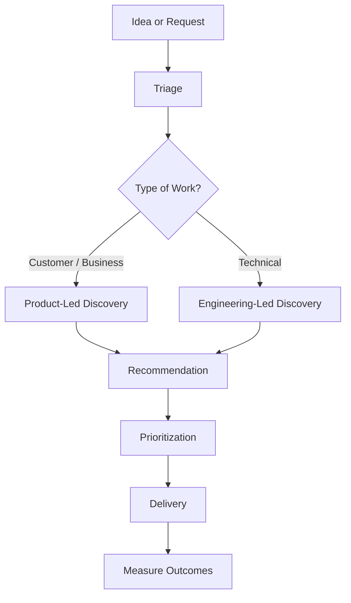

# Discovery Framework

Discovery is the process of turning an idea into an informed decision.

The objective isn't to produce documentation.

The objective is to reduce uncertainty until the team can confidently decide whether—and how—to move forward.

Not every initiative requires the same amount of discovery, but every initiative deserves enough discovery to answer the most important questions before development begins.

---

# The Discovery Flow

---

# Step 1: Intake

Every initiative starts with a request.

Requests can originate from:

- Customers
- Support
- Sales
- Product
- Engineering
- Leadership
- Compliance
- Market research

At this stage, avoid discussing solutions.

Instead, focus on understanding the request.

Questions to ask:

- What problem prompted this request?
- Who raised it?
- Why is it important?
- What happens if we do nothing?

---

# Step 2: Triage

Not every request deserves a full discovery effort.

Quickly determine:

- Is this already solved?
- Is it a duplicate?
- Does it align with strategy?
- Is more information needed?
- Is this urgent?
- Does another team already own this?

The goal of triage is to determine whether discovery should continue.

---

# Step 3: Determine the Discovery Track

Ask a simple question:

> What is the greatest uncertainty?

If the uncertainty is primarily customer or business related, use Product-Led Discovery.

Examples:

- New features
- Customer requests
- Workflow improvements
- Product strategy
- User experience

If the uncertainty is primarily technical, use Engineering-Led Discovery.

Examples:

- Platform modernization
- Security
- Technical debt
- Infrastructure
- Performance
- Framework upgrades

Choosing the correct track ensures the right people lead the investigation.

---

# Step 4: Investigation

Discovery should answer enough questions for the organization to make an informed decision.

Areas to investigate may include:

## Customer

- Who experiences the problem?
- How often?
- Current workflow
- Pain points
- Desired outcomes

## Business

- Strategic alignment
- Revenue opportunity
- Cost reduction
- Competitive advantage
- Compliance

## Technical

- Existing architecture
- Dependencies
- Risk
- Complexity
- Feasibility

## Operational

- Rollout considerations
- Support impact
- Documentation
- Training
- Monitoring

The depth of investigation should match the complexity of the initiative.

---

# Step 5: Recommendation

Discovery should end with a recommendation.

Possible outcomes include:

✅ Proceed

Proceed as planned.

---

🟡 Proceed with Changes

The idea has value but requires adjustments before implementation.

---

⏸ Delay

The problem is valid but should be addressed later.

---

❌ Do Not Proceed

Discovery determined the initiative does not create enough value or is not feasible.

Stopping work early is often a successful outcome of discovery.

---

# Step 6: Prioritization

Once discovery is complete, Product determines where the initiative fits within the broader portfolio.

Factors include:

- Customer value
- Business value
- Strategic alignment
- Risk
- Engineering effort
- Opportunity cost

Discovery informs prioritization.

It does not replace it.

---

# Discovery Deliverables

The output of discovery should be appropriate for the work.

Examples include:

- Discovery summary
- Problem statement
- Business case
- Technical recommendation
- Architecture proposal
- Wireframes
- Success metrics
- Executive summary

The goal is not to create documents.

The goal is to create clarity.

---

# Signs You've Done Enough Discovery

Discovery is probably complete when:

- The problem is clearly understood.
- The customer is identified.
- Success can be measured.
- Major risks are known.
- Engineering understands the work.
- Stakeholders understand the recommendation.
- The team can confidently decide whether to proceed.

Perfect certainty is impossible.

The goal is confidence—not perfection.
