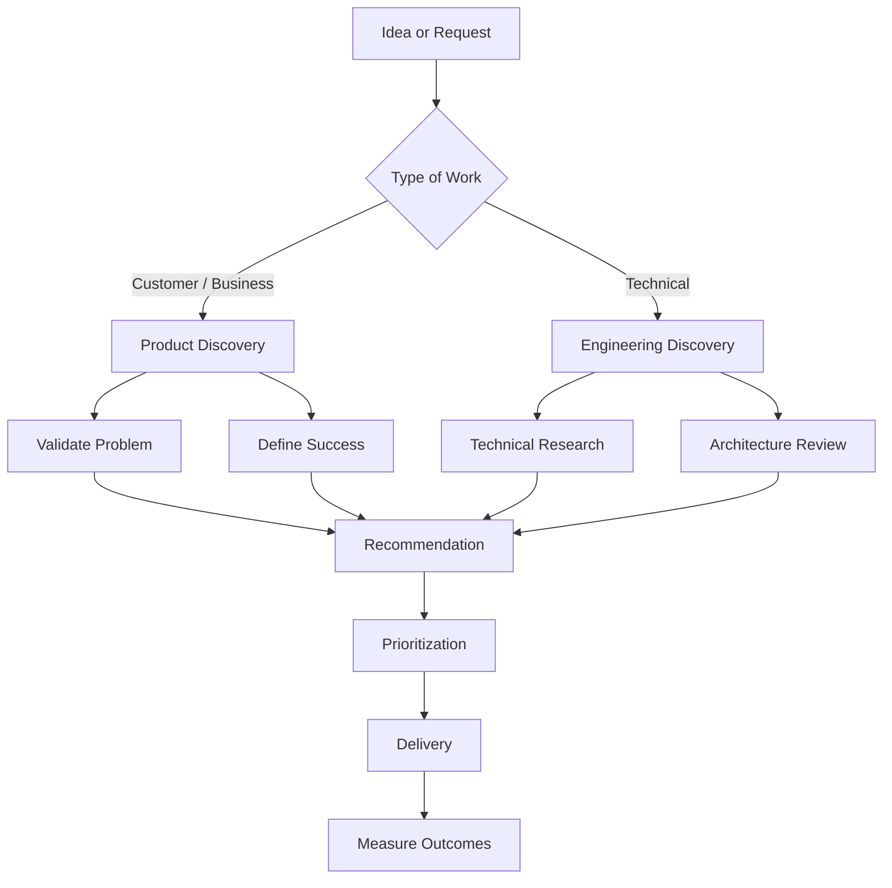

```mermaid
flowchart TD

A[Idea or Request] --> B{Type of Work}

B -->|Customer / Business| C[Product Discovery]

B -->|Technical| D[Engineering Discovery]

C --> E[Validate Problem]
C --> F[Define Success]

D --> G[Technical Research]
D --> H[Architecture Review]

E --> I[Recommendation]
F --> I
G --> I
H --> I

I --> J[Prioritization]
J --> K[Delivery]
K --> L[Measure Outcomes]
```

