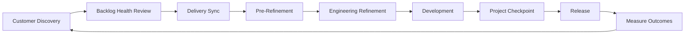

# Meetings

Meetings are one of the primary ways Product and Engineering work together.

They should create clarity, reduce uncertainty, transfer ownership, or enable decisions.

If a meeting accomplishes none of those things, it should be redesigned—or eliminated.

This operating model intentionally reduces unnecessary Product participation in Engineering ceremonies while increasing collaboration at the moments where Product creates the most value.

Product doesn't attend everything.

Product attends intentionally.

---

# Meeting Philosophy

Every recurring meeting should answer four questions:

- Why are we meeting?
- Who owns this meeting?
- What decision or outcome should it produce?
- Could this have been handled asynchronously?

Meetings should exist because they create value—not because the calendar says they should.

---

# Ownership Matters

One of the principles of this operating model is that meetings should reinforce ownership.

Product owns:

- Customer problems
- Business priorities
- Discovery
- Roadmap decisions

Engineering owns:

- Technical implementation
- Estimation
- Sprint execution
- Delivery planning

Meetings should reflect those responsibilities.

Product should not facilitate Engineering meetings.

Engineering should not own Product strategy.

---

# The Product Delivery Lifecycle

Work flows through a series of collaborative checkpoints.

Each meeting has a distinct purpose.

Every meeting exists to prepare the next stage—not repeat the previous one.

---

# Meeting Categories

## Discovery

Discovery meetings help determine whether work should move forward.

Examples:

- Customer Discovery
- Backlog Health Review

Primary question:

> Are we solving the right problem?

---

## Planning

Planning meetings prepare work for delivery.

Examples:

- Delivery Sync
- Pre-Refinement
- Engineering Refinement

Primary question:

> Are we ready to build?

---

## Validation

Validation meetings ensure implementation continues to align with business objectives.

Examples:

- Project Checkpoint

Primary question:

> Are we still building the right thing?

---

## Leadership

Leadership meetings evaluate the overall health of the Product organization.

Examples:

- Quarterly Planning
- Product Operations Review
- Executive Review

Primary question:

> Are we investing our time and resources effectively?

---

# Recommended Meeting Cadence

| Meeting | Owner | Typical Cadence |
|----------|-------|-----------------|
| Backlog Health Review | Product | Weekly |
| Delivery Sync | Product + Engineering | Weekly |
| Pre-Refinement | Product | Weekly |
| Engineering Refinement | Engineering | As Needed |
| Project Checkpoint | Product + Engineering | Every 1–2 Weeks |
| Quarterly Planning | Product | Quarterly |
| Product Operations Review | Product Leadership | Monthly |
| Executive Review | Product Leadership | Monthly or Quarterly |

Cadence should support the needs of the organization rather than follow a framework for its own sake.

---

# AI Should Reduce Administrative Work

AI should help teams spend less time managing meetings and more time making decisions.

Examples include:

- Creating agendas
- Summarizing discussions
- Capturing action items
- Documenting decisions
- Drafting follow-up communications
- Identifying risks
- Tracking unresolved questions

AI supports the meeting.

It does not replace the conversation.

---

# Measuring Meeting Effectiveness

Healthy meetings become more valuable over time.

Review meetings regularly by asking:

- Did we accomplish our objective?
- Were the right people in the room?
- Did we leave with clear decisions?
- Could part of this meeting become asynchronous?
- Is this meeting still necessary?

Every recurring meeting should continue earning its place on the calendar.

---

# What's Covered in This Section

The following chapters describe each meeting in the Product operating model.

- Backlog Health Review
- Delivery Sync
- Pre-Refinement
- Engineering Refinement
- Project Checkpoint
- Quarterly Planning
- Product Operations Review
- Executive Review

Each chapter explains:

- Purpose
- Owner
- Attendees
- Cadence
- Typical agenda
- Inputs
- Outputs
- Success measures

Together, these meetings create a repeatable operating cadence that balances Product strategy with Engineering autonomy.

---

# Success Looks Like

Successful Product organizations don't measure meetings by attendance.

They measure meetings by the quality of the decisions they enable.

When meetings are well designed:

- Product spends more time with customers.
- Engineering spends more time building.
- Decisions happen earlier.
- Work moves through delivery with fewer surprises.
- Ownership is clear.
- Teams collaborate without unnecessary process.

Meetings should create momentum—not bureaucracy.
